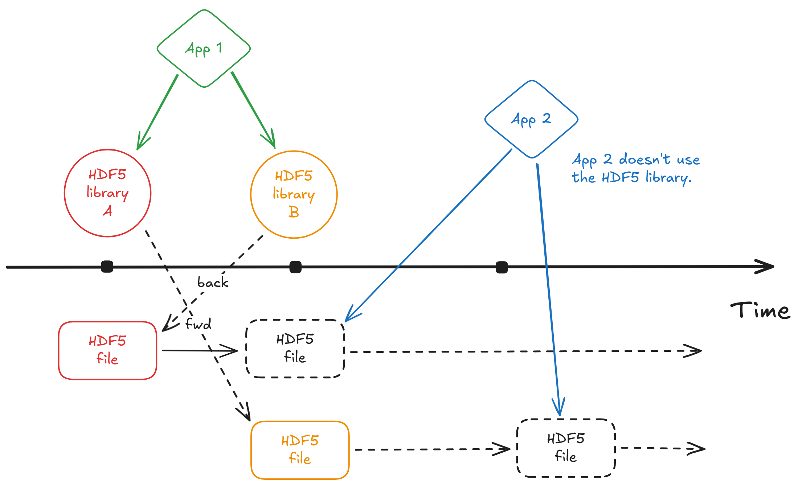

# HDF5 Versioning, Again?

The following discussion is **not** about versioning the data in an HDF5 from a user's perspective.
For that, see a previous episode on [Versioned HDF5](https://www.youtube.com/watch?v=8unCINLhNeM) and a presentation on the [Onion VFD at HUG25](https://youtu.be/Z3qUenGC-OQ).
This is about versioning in the context of the HDF5 library and file format.

In software, versioning helps us to manage the *conflict* between innovation and compatibility.

> The heart of self-describing data is marriage of a format and
an access library. (Jeffery R. Kuehn)

There is no direct correlation or causation between innovation in the library and the file format. That's why, speaking generally, we version them separately.
Also, applications might access HDF5 files directly without the HDF5 library.

**Note:** Often, versions are (sequences of) numbers. However, other unique identifiers are available to identify versions.

The concept of *compatibility* "entangles" versioning of the library and the file format. 

**Backward compatibility:** The latest HDF5 library version can read HDF5 files created with any earlier library version.

**Forward compatibility:** An earlier version of the HDF library can read HDF5 files created by a later HDF5 library version if the file does not contain on-disk features that were introduced after the earlier version.

**Maximum compatibility principle:** When writing data, the library will automatically use the earliest possible version of the file format and its constituent objects that can fully describe the information being stored.

## The version of the HDF5 library is what it says on the tin

At compile time, the header file `H5public.h` defines several C preprocessor macros that expose the library version:
- `H5_VERS_MAJOR`: The major version number.
- `H5_VERS_MINOR`: The minor version number.
- `H5_VERS_RELEASE`: The release number.
- `H5_VERS_INFO`: A string containing the full version information

### API (Application Programming Interface) compatibility

- Source-level compatibility, i.e., if an API is compatible, code written against an older version of the library can be recompiled with a newer version without source code changes.
- See API compatibility macros

### ABI (Application Binary Interface) compatibility

- Binary-level compatibility, i.e., if an ABI is compatible, an application compiled against an older version of the library can be run with a newer version of the shared library without being recompiled.
- `MINOR` updates are **not** ABI compatible

## The version of the HDF5 file format is more complicated...

### HDF5 file format specification versions

See [here](https://support.hdfgroup.org/documentation/hdf5/latest/_s_p_e_c.html).

In [version 3.0](https://support.hdfgroup.org/documentation/hdf5/latest/_f_m_t3.html) of the specification, the term 'version' occurs 566 time. The count was 66 in [version 1.0](https://support.hdfgroup.org/documentation/hdf5/latest/_f_m_t1.html).

### The Mighty Superblock

- Has a version version, currently `[0, 1, 2, 3]`
- Sets "expectations" for the file
- When using the HDF5 library, the superblock version is set implicitly, based on feature use, at file creation time
- The library adheres to a principle of using the lowest possible superblock version that can support the requested features

**Note:** The superblock version is not and cannot be used as a "HDF5 file version."

An HDF5 file is not a static artifact; it can be a "living" container.
Different objects within a single file may have been created or modified at different times by applications using different versions of the HDF5 library.
A single, file-level version number would therefore be ambiguous and potentially misleading. For instance, a file might be created with HDF5 1.8,
and then later, a new dataset using a 1.12 feature could be appended to it. A single version stamp for the file would fail to capture this intricacy.

## Recommendations

Use common sense.

### Software Developers
1. The choice of HDF5 library version should be a deliberate architectural decision, not an afterthought.
2. Make an explicit compatibility choice.
3. Enforce compatibility programmatically: use the [`H5Pset_libver_bounds`](https://support.hdfgroup.org/documentation/hdf5/latest/group___f_a_p_l.html#gacbe1724e7f70cd17ed687417a1d2a910)
4. Migrate incrementally: use the API compatibility macros first

### Data Curators and Archivists
1. Mandate a metadata provenance policy
2. Standardize on a long-term support (LTS) format

### System Administrators and HPC Center Staff
1. Provide multiple HDF5 versions
2. Use environment modules or containers

## Questions

### 1. I'm a developer of an independent HDF5 implementation, and compatibility is not a concern for me. What is the "best" HDF5 file format version?

I'm unsure.

### 2. What, if anything, changes in HDF5 2.0.0 concerning versioning?

Ask Scot!

HDF5 2.0.0, which will introduce native complex number support and, crucially, will formally adopt Semantic Versioning.
This move to SemVer is an attempt to pay down the "complexity debt" incurred over the years.
By making versioning more predictable, The HDF Group aims to improve the
Compatibility story from a developer and tooling perspective, making the entire ecosystem easier to navigate.

### 3. Is there light at the end of the tunnel?

([Yes!](https://www.youtube.com/watch?v=EgtAiYslNGg))
