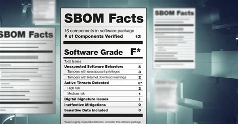

# SBOMs & Sunshine: The HDF5 SHINES Check-In

HDF5 SHINES = **S**ecuring **H**DF5 for **I**ndustry, **N**ational Security, **E**ngineering, and **S**cience

## Software Bill of Materials (SBOM)

### References

- [Framing Software Component Transparency: Establishing a Common Software Bill of Materials (SBOM)](https://www.cisa.gov/sites/default/files/2024-10/SBOM%20Framing%20Software%20Component%20Transparency%202024.pdf)
- [How to create SBOMs in Java with Maven and Gradle](https://snyk.io/blog/create-sboms-java-maven-gradle/)
- [Automating creation of Software Bills of Materials](https://archive.fosdem.org/2021/schedule/event/automating_creation_of_spdx_sbom/)
- [Complete Guide to C/C++ SBOM Generation](https://sbomgenerator.com/guides/cpp)
- [Spack SBOM example](https://github.com/spack/spack-sbom/blob/1b16b6ed9f2c71fd9ff71951433b73d39f4650a5/examples/zlib.json)

### HDF5 build process intricacies

- Who is the audience? (integrators, package maintainers, etc.)
- Modularity is key
- Gazillion of CMake options
  - Ideally CMake would take care of this, but ...   
- Currently looking at [CycloneDX](https://cyclonedx.org/)
- Check [work in progress](https://github.com/HDFGroup/hdf5-ssp-sig/tree/main/templates/sbom)
- Build phases
  - `pre-build` => HDF5 source tarball
  - `build` => Build options (CMake configuration)
  - `post-build` => binaries
- During `build`: core, addons (filters, VFD), tools, HL interfaces
- During `post-build`: plugins, bundles
- Got ideas? => contact [me](mailto:gheber@hdfgroup.org)

## First audit

**Q:** How many `hdf5-2.0.0.tar.gz` tarballs with non-matching SHA256 checksums are in circulation?

**A:** We don't know. I'm aware of at least three.

👉 Follow the story on [GitHub](https://github.com/HDFGroup/hdf5-ssp-sig/tree/main/audit/proofs/hdf5-core/2.0.0/psirt/release-integrity/PRISUPP-2204)

This audit got triggered by a support ticket from a user who reported a SHA256 hash mismatch between the the tarballs on our [support site](https://support.hdfgroup.org/releases/hdf5/v2_0/v2_0_0/downloads/index.html) and on [GitHub](https://github.com/HDFGroup/hdf5/releases/tag/2.0.0).

In the reported instance, the packaging variance was benign, i.e., the contents were byte-identical. The artifacts were replaced.

However, in searching for other variants I found a version of `hdf5-2.0.0.tar.gz` that is materially [different](https://github.com/HDFGroup/hdf5-ssp-sig/blob/main/audit/proofs/hdf5-core/2.0.0/psirt/release-integrity/PRISUPP-2204/artifacts/diffs/fossies-github.filehash.diff) (files missing and file differences). Premature publication/release retagging combined with aggressive download bots is most likely to blame, in this case.

The investigation is ongoing, but exposed already several weaknesses in our publishing and CI/CD artifact handling process.

## HDF5 Safety, Security, & Privacy (SSP) Special Interest Group (SIG)

## HDF5 Product Security Incident Response Team (PSIRT)

## Getting involved

## Acknowledgement

> This material is based upon work supported by the U.S. National Science Foundation under Federal Award No. 2534078. Any opinions, findings, and conclusions or recommendations expressed in this material are those of the author(s) and do not necessarily reflect the views of the National Science Foundation.
